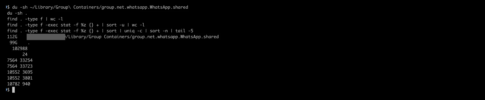

# WhatsApp for Mac re-downloads the same media tens of thousands of times

A single one-on-one chat grew to **99 GB** on disk: **102,988 files**, but only
**24 unique file sizes**. The count kept going up while I was measuring it. A later
scan found the same pattern in **5 of 84** media folders.

- [TL;DR](#tldr)
- [Am I affected?](#am-i-affected)
- [Environment](#environment)
- [Investigation](#investigation)
- [Observed behavior vs. possible cause](#observed-behavior-vs-possible-cause)
- [Impact](#impact)
- [Workaround](#workaround)
- [Status](#status)
- [Disclaimer](#disclaimer)

## TL;DR

- My Mac got slow. The cause wasn't CPU or RAM. The disk was 93% full.
- 112 GB of that was WhatsApp's group container, and **99 GB came from one chat's media folder**.
- That folder held 102,988 files, but only **24 distinct file sizes**. The same few
  attachments had been written to disk over and over, more than 10,000 times each.
  An MD5 check confirmed it: 10,786 files of 940 bytes, **one** distinct hash.
- Between two measurements a few minutes apart, every one of the top repeated sizes
  went up by exactly one copy. The loop was still running during the investigation.
- It's not just one chat. [`check.sh`](check.sh) flagged **5 of 84** media folders:
  3 chats and both status folders. One of them holds 43,026 files with only
  **2 distinct sizes**, but takes up just 28 MB, so a disk-usage check would never catch it.
- I can't see WhatsApp's code, so I don't claim a root cause. The pattern looks like
  a loop that saves the attachment again because it never marks it as saved.

## Am I affected?

Quick look at how big WhatsApp's media folder is:

```zsh
du -sh ~/Library/Group\ Containers/group.net.whatsapp.WhatsApp.shared/Message/Media
```

A small number doesn't mean you're safe: an affected folder can hold tens of thousands
of tiny files and barely register (see `chat_12` below). The reliable check is the detector:

```zsh
git clone https://github.com/reverx99/whatsapp-macos-media-duplication.git
cd whatsapp-macos-media-duplication
less check.sh        # read it first; it's short
./check.sh           # scan all media folders
./check.sh --hash    # also check that the repeated files are identical
./check.sh --watch 300   # also count flagged folders again after 5 minutes
```

`check.sh` is **read-only**. It never deletes, moves or writes anything. It never prints
folder names (those contain phone numbers and chat IDs). Folders show up as `chat_1`,
`group_1`, `status_1` and so on, so the output is safe to paste in a public issue.

For each media folder it reports:

| Column       | Meaning                                                              |
|--------------|----------------------------------------------------------------------|
| `SIZE`       | Total size of the files in the folder                                |
| `FILES`      | Number of files                                                      |
| `UNIQ_SIZES` | Number of distinct file sizes                                        |
| `RATIO`      | `FILES / UNIQ_SIZES`                                                 |
| `FLAG`       | `SUSPICIOUS` when `FILES > 1000` **and** `RATIO >= 20`               |

**Why these thresholds:** photos, voice notes and documents almost never share an exact
byte size, so a healthy chat has a ratio close to 1. On my machine, all 79 unflagged
folders were between 1.0 and 6.0, and the flagged ones between 197 and 21,513. A ratio of 20
means that, on average, every distinct size shows up 20 times. That doesn't happen in
normal use. The affected chat here had a ratio of about 4,300 (102,988 / 24). The
1,000-file minimum keeps small chats with a few repeated stickers from being flagged.
You can change both with `MIN_FILES=... MIN_RATIO=... ./check.sh`.

For flagged folders, `--hash` reports how many distinct MD5 hashes the most repeated
size has (1 means every copy is identical), and `--watch SECONDS` counts the files
again after a delay to show whether the folder is still growing. It counts files
because file timestamps can't be trusted here (see step 10).

Exit status: `0` nothing suspicious, `1` at least one suspicious folder, `2` usage or path error.

> On recent macOS versions, reading another app's container may show a
> "Terminal would like to access data from other apps" prompt, or fail with
> *Operation not permitted*. Allow the prompt, or give your terminal Full Disk Access in
> System Settings > Privacy & Security.

Output from my machine is in [step 11](#11-scanning-every-chat-with-checksh).

## Environment

| | |
|---|---|
| Hardware | MacBook Air (M1), 8 GB RAM, 256 GB SSD (228 Gi data volume) |
| macOS | 27.0 (build 26A428) |
| WhatsApp for Mac | 26.37.76 (build 1074875611) |
| Install source | Mac App Store |
| Shell | zsh, BSD userland |

## Investigation

All commands are standard macOS tools. Paths use `~`, and chat folder names are redacted.
Screenshots are in [`evidence/`](evidence/).

### 1. Symptom

The Mac felt slow in general. Spotlight (<kbd>Cmd</kbd>+<kbd>Space</kbd>) and app
launches were noticeably laggy.

### 2. CPU: fine. Swap: not fine.

`htop` showed a load average of about 3.4–4.4 on 8 cores, so CPU wasn't the bottleneck.
But swap was at **3.24 G of 4 G**. Uptime was 14 days.


### 3. Memory pressure: green

Activity Monitor showed green memory pressure: 6.37 GB used, 2.23 GB compressed,
3.18 GB swap. RAM usage was high but not the root cause.


### 4. Spotlight indexing: ruled out

```zsh
mdutil -sa
```

No volume was actively indexing.

### 5. The disk was almost full

```zsh
df -h /System/Volumes/Data
```

```text
Size   Used   Avail  Capacity     (other columns trimmed)
228Gi  173Gi  13Gi   93%
```

macOS needs free space for swap files and caches. With only 13 Gi free on a 228 Gi
volume, heavy swap use slows down the whole system.


### 6. Narrowing it down

```zsh
du -sh ~/* ~/Library/* 2>/dev/null | sort -h | tail -20
du -sh ~/Library/Group\ Containers/* 2>/dev/null | sort -h | tail -10
du -sh ~/Library/Group\ Containers/group.net.whatsapp.WhatsApp.shared/* | sort -h | tail -5
du -sh ~/Library/Group\ Containers/group.net.whatsapp.WhatsApp.shared/Message/Media/* | sort -h | tail -10
```

```text
~/Library                                            168G
└─ Group Containers                                  114G
   └─ group.net.whatsapp.WhatsApp.shared             112G
      └─ Message                                     112G   (ChatStorage.sqlite is only 160M)
         └─ Media
            ├─ <one-on-one chat>                      99G   ← this one
            ├─ <status folder>                       5.0G
            ├─ <another chat>                        3.4G
            └─ <status folder>                       3.0G
```

The message database itself is only 160 MB. Almost everything is media, and almost all
of that is in **one chat folder**.

A side note: the two status folders add up to **8 GB**. Statuses expire after 24 hours,
so keeping 8 GB of them on disk is odd. It may be the same problem or a separate one.


### 7. Inside the 99 GB folder

```zsh
cd <the 99G chat folder>
find . -type f | wc -l                                          # file count
find . -type f | sed 's/.*\.//' | sort | uniq -c | sort -n | tail -5   # by extension
find . -type f -exec stat -f %z {} + | sort | uniq -c | sort -n | tail -5   # repeated sizes
```

- **102,966 files**, none larger than 200 MB, about 1 MB on average
- Subfolders go back to **2026-07-20**. If the growth started then, that's roughly
  1.4 GB a day on average over ~70 days.

Files by extension:

| Extension | Files  |
|-----------|-------:|
| `.thumb`  | 38,300 |
| `.opus`   | 27,580 |
| `.pdf`    | 15,126 |
| `.jpg`    | 12,395 |
| `.zip`    |  9,564 |

Most repeated file sizes (first measurement):

```text
 count  bytes
  7563  33254
  7563  33723
 10551   3695
 10551   3801
 10781    940
```

Tens of thousands of files, but the same handful of byte sizes over and over. The
repeated counts also come in pairs (7,563 / 7,563 and 10,551 / 10,551), which suggests
files are written together as a set. For example, 2 × 7,563 = 15,126, exactly the
number of `.pdf` files.


### 8. Second measurement, a few minutes later

```zsh
find . -type f | wc -l
find . -type f -exec stat -f %z {} + | sort -u | wc -l
find . -type f -exec stat -f %z {} + | sort | uniq -c | sort -n | tail -5
```

- **102,988 files** (+22 since the first count)
- **Only 24 unique file sizes across all 102,988 files**
- Each of the top counts went up by **exactly 1**:

```text
 before → after   bytes
  7563  →  7564   33254
  7563  →  7564   33723
 10551  → 10552    3695
 10551  → 10552    3801
 10781  → 10782     940
```

The duplication was still running during the investigation. The pattern is consistent with
each cycle writing one more copy of each attachment.



### 9. Are the copies byte-for-byte identical?

```zsh
find . -type f -size 940c  -exec md5 -q {} + | sort | uniq -c
find . -type f -size 3801c -exec md5 -q {} + | sort | uniq -c
```

| Size       | Files  | Distinct MD5 hashes |
|------------|-------:|--------------------:|
| 940 bytes  | 10,786 | **1**               |
| 3801 bytes | 10,556 | **1**               |

Every file at each size is byte-for-byte identical. These aren't different attachments
that happen to share a size; they are the same attachment saved over and over.

### 10. How fast is it growing?

```zsh
find . -type f -mmin -60 | wc -l      # files modified in the last 60 minutes
find . -type f | wc -l; sleep 300; find . -type f | wc -l
```

- Files modified in the last 60 minutes: **0**
- Two counts 5 minutes apart: **103,076 → 103,084** (+8)

This result contradicts itself, and the contradiction is informative. Eight new files
showed up within five minutes, but the `-mmin -60` check didn't count any of them as
recent. So the new copies get an **old modification time**, probably the original
message's timestamp.

I then checked creation (birth) time too (`stat -f %B`, the equivalent of
`find -Bmin -60`). It also found nothing recent, even though `chat_2` grew by 18 files
between two runs (step 11). So **both timestamps are old** on new copies.
Anything that sorts or filters by date, like `find -mmin`, `find -Bmin` or
Finder's "Date Modified" and "Date Created", won't show the growth.
The only reliable signal is counting files over time, which is what
`check.sh --watch` does.

At 8 files per 5 minutes, that's roughly 100 new files an hour. The rate
isn't constant, though: this folder gained 88 files between the second measurement
(step 8) and the first `check.sh` run.

### 11. Scanning every chat with check.sh

After writing [`check.sh`](check.sh), I ran it on the whole `Media` folder
(84 subfolders) with `--hash`. Output, trimmed to the flagged folders plus the largest
unflagged ones for comparison:

```text
FOLDER         SIZE     FILES  UNIQ_SIZES     RATIO  NEW_1H  FLAG
---------- -------- --------- ----------- --------- -------  ----------
chat_1        98.8G    103084          24    4295.2       0  SUSPICIOUS
status_1       5.0G      4136          21     197.0       0  SUSPICIOUS
chat_2         3.4G     14118          30     470.6       0  SUSPICIOUS
status_2       3.0G      1176           5     235.2       0  SUSPICIOUS
chat_3       558.4M      2136        1265       1.7       8  -
chat_4       189.8M       274         209       1.3       0  -
group_1      123.6M       340         263       1.3       0  -
...
chat_12       27.7M     43026           2   21513.0       0  SUSPICIOUS
...

Folders scanned: 84 (chats 53, groups 27, status 2, other 2)
Total size:      111.8G
Status folders:  2, total 7.9G (statuses expire after 24h)
Suspicious:      5 folder(s)

chat_1: most repeated size is 940 bytes (10787 files, 10.5% of the folder)
  --hash: 10787 files of 940 bytes -> 1 distinct MD5 (byte-for-byte identical)
status_1: most repeated size is 992018 bytes (526 files, 12.7% of the folder)
  --hash: 526 files of 992018 bytes -> 1 distinct MD5 (byte-for-byte identical)
chat_2: most repeated size is 96900 bytes (1684 files, 11.9% of the folder)
  --hash: 1684 files of 96900 bytes -> 1 distinct MD5 (byte-for-byte identical)
status_2: most repeated size is 6415182 bytes (340 files, 28.9% of the folder)
  --hash: 340 files of 6415182 bytes -> 1 distinct MD5 (byte-for-byte identical)
chat_12: most repeated size is 692 bytes (21513 files, 50.0% of the folder)
  --hash: 21513 files of 692 bytes -> 1 distinct MD5 (byte-for-byte identical)
```

This run used an early version of `check.sh` with a `NEW_1H` column (files modified
in the last hour). It showed 0 for `chat_1` even though the folder had just grown by
8 files. A later version based on creation time also showed 0 everywhere. The column
was removed and replaced by `--watch` (see step 10).

A second run a short while later found `chat_2` at **14,136 files** (+18), with its
96,900-byte count up from 1,684 to 1,687.

A third run with `--watch 300` found no change at all:

```text
Growth over 300s (--watch):
  chat_1        103084 ->    103084  (+0)
  status_1        4136 ->      4136  (+0)
  chat_2         14136 ->     14136  (+0)
  status_2        1176 ->      1176  (+0)
  chat_12        43026 ->     43026  (+0)
```

`chat_1` and `chat_2` also had exactly the same counts as in the previous run. So the
duplication doesn't run all the time. It comes in bursts: +8 files in 5 minutes, then
nothing for a while.

What this adds:

- **Five folders are affected, not one.** Three one-on-one chats and both status folders
  show the same pattern: thousands of files, a handful of sizes. No group was flagged.
- **`chat_12` is extreme in a different way:** 43,026 files with only **2 distinct
  sizes** (21,513 of each, a pair again), but only 27.7 MB on disk. It's invisible to
  `du`, but it's still 43,000 pointless files.
- **The 3.4 GB "next largest chat" from step 6 is affected too, and still growing**
  (`chat_2`: 14,118 → 14,136 files, 30 sizes).
- **In every flagged folder, the most repeated size is one file saved over and over**
  (`--hash` found exactly one distinct MD5 each time), from 340 copies of a 6.4 MB
  status file to 21,513 copies of a 692-byte file.
- **The 8 GB of statuses are the same bug**, not just slow cleanup: `status_1` has
  4,136 files with 21 sizes, and `status_2` has 1,176 files with 5 sizes.
- **`chat_1` kept growing.** It went from 102,988 files (step 8) to 103,084, and its
  940-byte count from 10,782 to 10,787.
- **Healthy folders look healthy.** Every unflagged folder had a ratio between 1.0
  and 6.0, far below the threshold of 20.

## Observed behavior vs. possible cause

**Observed (measured on my machine):**

- One chat's media folder: 99 GB, 102,988 files, 24 unique file sizes.
- The most common sizes repeat 7,500–10,800 times each, and the copies are identical.
- Between two measurements a few minutes apart, the file count grew and every top
  repeated size went up by exactly one.
- Files were still being written while WhatsApp was running, in bursts: +8 files in
  5 minutes at one point, then no change over a later 5-minute window.
- Subfolders date back to 2026-07-20, so this had been building up for weeks.
- The same pattern shows up in 5 of 84 media folders (3 chats, 2 status folders),
  so it isn't tied to one conversation.
- In every affected folder, the files at the most repeated size are byte-for-byte
  identical (one distinct MD5 each).
- New copies carry old modification *and* creation times, so date-based checks
  don't show the growth (step 10).

**Possible cause (hypothesis, not verified):**

I don't have access to WhatsApp's source code, so this is **not** a root-cause analysis.
The pattern fits a download or retry loop that saves an attachment to a new path but
never records it as downloaded. On the next pass (sync, relaunch or a periodic retry),
the app thinks the media is still missing and downloads it again. Other explanations
are possible, such as a sync or migration job that keeps re-importing the same messages.
Only WhatsApp can confirm the cause.

One clue narrows it a little: new copies arrive with **old** creation and modification
times. A fresh network download would normally get the current time. Copying an
existing file with its metadata preserved keeps the old dates, so the duplicates may come
from a local copy or re-import step rather than a real re-download. That's still a guess.

Open question: if those copies are APFS clones, they could share storage on disk, and
`du` would overstate how much space they really take. The disk being 93% full suggests
most of it is real. Comparing `df -h` before and after deleting the container (see
[Workaround](#workaround)) would settle it.

## Impact

- **Disk exhaustion:** 99 GB from one chat (about 110 GB across all affected folders),
  on a 256 GB machine. Left alone, it keeps
  growing until the disk is full.
- **Swap pressure:** with little free space, macOS struggles to manage swap. That made
  an 8 GB machine feel much slower than its memory pressure suggested.
- **SSD wear:** every duplicate is a real write. Tens of GB of pointless writes wear
  out a non-replaceable SSD.
- **General slowness:** Spotlight, app launches and everyday use all got laggy. Nothing
  in the UI points to WhatsApp as the cause.
- **Backups:** Time Machine and other backups that include `~/Library` copy all of this too.

## Workaround

> [!WARNING]
> This deletes WhatsApp's local data on the Mac. **Any media that exists only on the
> Mac will be lost.** Save anything you need first. Your phone keeps its own copy of
> the chats.

1. **Quit WhatsApp** on the Mac (<kbd>Cmd</kbd>+<kbd>Q</kbd>, not just closing the window).
2. **Log out the Mac as a linked device.** On your phone: WhatsApp > Settings >
   Linked Devices > tap the Mac > Log out.
3. **Delete the container.** Move this folder to the Trash:
   ```text
   ~/Library/Group Containers/group.net.whatsapp.WhatsApp.shared
   ```
   (In Finder: <kbd>Cmd</kbd>+<kbd>Shift</kbd>+<kbd>G</kbd>, paste
   `~/Library/Group Containers`, then drag the folder to the Trash and empty it.)
   Run `df -h /System/Volumes/Data` before and after to see how much space you
   actually got back.
4. **Turn off media auto-download** in Settings > Storage and Data: on the phone now,
   and on the Mac as soon as it's linked again, before you open the affected chat.
5. **Re-link** the Mac by scanning the QR code.
6. Run `./check.sh` again after a day to make sure it isn't coming back.

**Don't use "Clear chat" or delete media from inside the Mac app** to free up space.
Deletions on a linked device may sync to your phone and other devices, and you could
lose media there too.

## Status

- **2026-09-29:** Reported to WhatsApp via in-app support.
- WhatsApp's response: [TODO]

If you're affected too, please report it to WhatsApp as well (in the app: Settings > Help)
and feel free to open an issue here with your (anonymized) `check.sh` output.

## Disclaimer

This is an independent investigation. It is not affiliated with, endorsed by, or
sponsored by WhatsApp or Meta. "WhatsApp" is a trademark of its owner. All
measurements come from my own machine and my own data. Chat identifiers, phone
numbers, usernames and paths have been removed. `check.sh` is provided as-is, under
the [MIT License](LICENSE).
